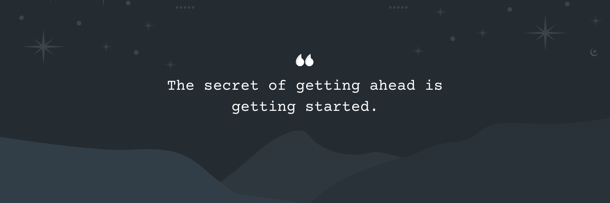

## Hey there 👋

I'm **Yedhu Krishnan**.

I work across design and development with a focus on clean UX and smooth apps.  
I like building things that feel simple and useful.  
I have worked on Android, iOS, web, SaaS, cloud, and data tools.

👉 **[My Portfolio](https://yedhukrrish.github.io/portfolio/index.html)**

---

## 📌 Pinned Work

 

 

---

## 📊 GitHub Stats

---

## 💼 Skills

### **Languages**
Kotlin • Java • JavaScript • TypeScript • Python • C • C# • Dart • Solidity

### **Mobile & Frontend**
Android (Kotlin) • Jetpack Compose • React • Flutter • Next.js

### **Backend & Frameworks**
Node.js • Express • REST APIs • web3.js • IPFS • Microservices • Serverless

### **Databases**
MongoDB • DynamoDB • PostgreSQL • Vector DB (Chroma)

### **Cloud & DevOps**
AWS (EC2, S3, IAM, Amplify, Lambda, CloudWatch, CloudFront, RDS, API Gateway, SNS, SQS, Route 53, ECR, ECS, VPC, LB)  
Docker • CI/CD (GitHub Actions, Jenkins) • Git • GCP • Firebase

### **Platforms & Tools**
Linux • Postman • VS Code • Android Studio • Figma • Jira • Notion • Slack • MS Planner

### **Key Concepts**
System design • API design • Data privacy (HIPAA, GDPR) • Testing • Debugging

### **Management & Product**
Project management • Product planning • Software design • Leadership • Agile • UI/UX work • Team work • Client talks • Cross-team work • Communication

### **AI & Automation Tools**
Windsurf • Cursor • GitHub Copilot • GPT-Codex • Figma AI • Canva AI • OpenAI API • Gemini API

---

## 🧰 Toolbox (Visual)

---

## ✨ Extra

### Activity Graph  

### Visitor Count  

---

## 🐍 Contribution Snake  

---

## 💬 Quote of the Day  
> “Code is the closest thing we have to magic.”

---

## 🎧 Now Playing  

---

## 🎯 Streaks  

---

## 📦 Trophies  

---

## 🧑‍💻 Coding Stats (Wakatime)  
*(Only works if Wakatime is active)*

